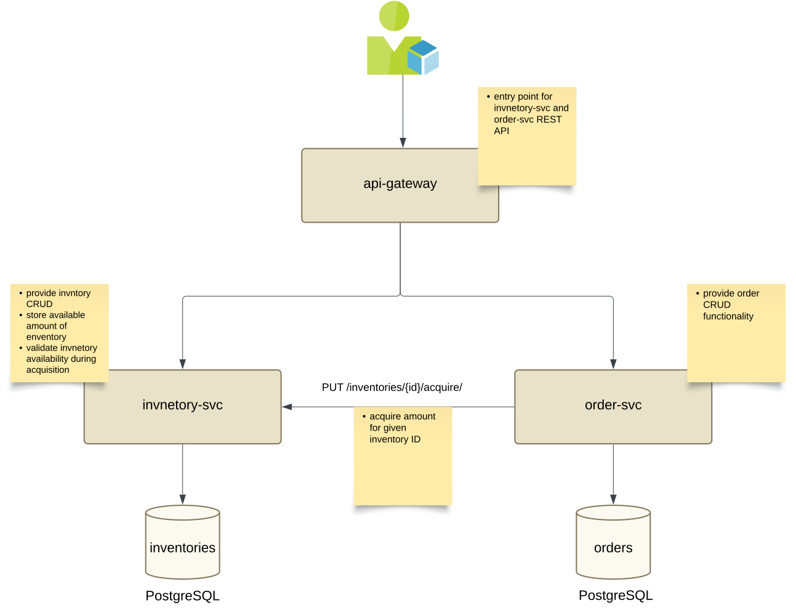

# inventory-order application



## Introduction
The project presents an application used for inventories and order of items of specific inventory type creation.

### Technical stack
`Java 21` <br>
`Spring Boot 3.4.2` <br>
`PostgreSql 12`<br>

### Modules
- __api-gateway__ - Spring API Gateway service used for routing requests to underlying service
- __order-svc__ - service used for orders CRUD
- __inventory-svc__ - service used for inventories CRUD
- __inventory-api-client__ - utility project for creating Spring Feign REST client of *inventory-svc*
- __inventory-api-contract__ - utility project for storing REST client contract of *inventory-svc*
- __order-api-contract__ - utility project for storing REST client contract of *order-svc*

## Deployment

### Kubernetes deployment 
In order to start the entire project *Kubernetes* cluster should be configured on local

```shell
# maven package
mvn package

# inventory-svc deploy
docker build -t inventory-svc ./inventory-svc/

# delete existing deployments
kubectl delete -f ./inventory-svc/k8s/secret.yaml
kubectl delete -f ./inventory-svc/k8s/pg-deployment.yaml
kubectl delete -f ./inventory-svc/k8s/config-map.yaml
kubectl delete -f ./inventory-svc/k8s/inventory-svc-deployment.yaml

# deploy new version
kubectl create -f ./inventory-svc/k8s/secret.yaml
kubectl create -f ./inventory-svc/k8s/pg-deployment.yaml
kubectl create -f ./inventory-svc/k8s/config-map.yaml
kubectl create -f ./inventory-svc/k8s/inventory-svc-deployment.yaml

# order-svc deploy
docker build -t order-svc ./order-svc/

# delete existing deployments
kubectl delete -f ./order-svc/k8s/secret.yaml
kubectl delete -f ./order-svc/k8s/pg-deployment.yaml
kubectl delete -f ./order-svc/k8s/order-svc-deployment.yaml

# deploy new version
kubectl create -f ./order-svc/k8s/secret.yaml
kubectl create -f ./order-svc/k8s/pg-deployment.yaml
kubectl create -f ./order-svc/k8s/order-svc-deployment.yaml

# api-gateway deploy
docker build -t api-gateway-svc ./api-gateway/

# delete existing deployments
kubectl delete -f ./api-gateway/k8s/config-map.yaml
kubectl delete -f ./api-gateway/k8s/api-gateway-deployment.yaml

# deploy new version
kubectl create -f ./api-gateway/k8s/config-map.yaml
kubectl create -f ./api-gateway/k8s/api-gateway-deployment.yaml
```
### Swagger documentation
In order to visualize Swagger documentation of related projects in *api-gateway*, it is required ot select project name in __Select a definition__ dropdown menu.
* [inventory-svc](http://localhost:8082/inventories/swagger-ui.html)
* [order-svc](http://localhost:8081/orders/swagger-ui.html)
* [api-gateway](http://localhost:8083/swagger-ui.html)
